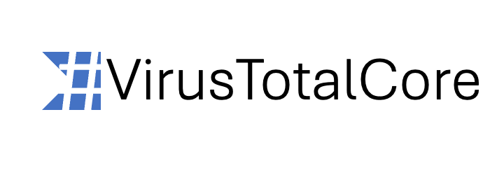

[](https://github.com/hunterlan/VirusTotalCore/actions/workflows/dotnet.yml)


# VirusTotalCore
VirusTotalCore is an unofficial .NET library that gives a possibility to work with VirusTotal by implemented API. With this library, 
developers can request scans for URLs, files, get report about domains and IPs, retrieve comments and votes from 
community and add owns.

Currently, next endpoints is implemented in library:
- IP addresses
- Comments
- Domains
- Files
- URLs

# Installation

Install the package for the resource you need:
```sh
dotnet add package VirusTotalCore.Files
dotnet add package VirusTotalCore.Urls
dotnet add package VirusTotalCore.IpAddresses
dotnet add package VirusTotalCore.Domains
dotnet add package VirusTotalCore.Comments
```

# Quickstart

```csharp
using VirusTotalCore.Urls.Endpoints;

var endpoint = new UrlEndpoint("<your-api-key>");
var report = await endpoint.GetReport("https://example.com");
Console.WriteLine($"Malicious votes: {report.Attributes.LastAnalysisStats.Malicious}");
```

# Usage examples

## Files

```csharp
using VirusTotalCore.Files.Endpoints;

var endpoint = new FilesEndpoint("<your-api-key>");
await using var stream = File.OpenRead("sample.exe");
var hash = await endpoint.PostFile(stream, "sample.exe", password: null);
var report = await endpoint.GetReport(hash);
Console.WriteLine($"Malicious: {report.Attributes.LastAnalysisStats.Malicious}");
```

## URLs

```csharp
using VirusTotalCore.Urls.Endpoints;

var endpoint = new UrlEndpoint("<your-api-key>");
var report = await endpoint.GetReport("https://example.com");
Console.WriteLine($"Malicious: {report.Attributes.LastAnalysisStats.Malicious}");
```

## IP Addresses

```csharp
using VirusTotalCore.IpAddresses.Endpoints;

var endpoint = new AddressIpEndpoint("<your-api-key>");
var report = await endpoint.GetReport("8.8.8.8");
Console.WriteLine($"Harmless: {report.Attributes.LastAnalysisStats.Harmless}");
```

## Domains

```csharp
using VirusTotalCore.Domains.Endpoints;

var endpoint = new DomainsEndpoint("<your-api-key>");
var report = await endpoint.GetReport("example.com");
Console.WriteLine($"Malicious: {report.Attributes.LastAnalysisStats.Malicious}");
```

## Comments

```csharp
using VirusTotalCore.Comments.Endpoints;

var endpoint = new CommentEndpoint("<your-api-key>");
var comments = await endpoint.GetLatestComments(filter: null, cursor: null);
foreach (var comment in comments.Comments)
    Console.WriteLine(comment.Attributes.Text);
```

# Error handling

All VirusTotal-specific exceptions inherit from `VirusTotalException`, allowing you to catch them with a single handler 
or handle specific cases individually:

```csharp
using VirusTotalCore.Common.Exceptions;
using VirusTotalCore.Urls.Endpoints;

var endpoint = new UrlEndpoint("<your-api-key>");
try
{
    var report = await endpoint.GetReport("https://example.com");
}
catch (NotFoundException ex)
{
    Console.WriteLine($"Not found: {ex.Message}");
}
catch (QuotaExceededException ex)
{
    Console.WriteLine($"Quota exceeded: {ex.Message}");
}
catch (VirusTotalException ex)
{
    Console.WriteLine($"VirusTotal error: {ex.Message}");
}
```

# Minimal requirements

Library requires to use at least .NET 8.

**External dependencies**

- [XUnit](https://github.com/xunit/xunit) (dev/test only)

# Contributing
See [CONTRIBUTING](CONTRIBUTING.md)

# License
See [LICENSE](LICENSE)

# Note

Ensure to stick with the terms of use and guidelines provided by VirusTotal when using this library in your applications.